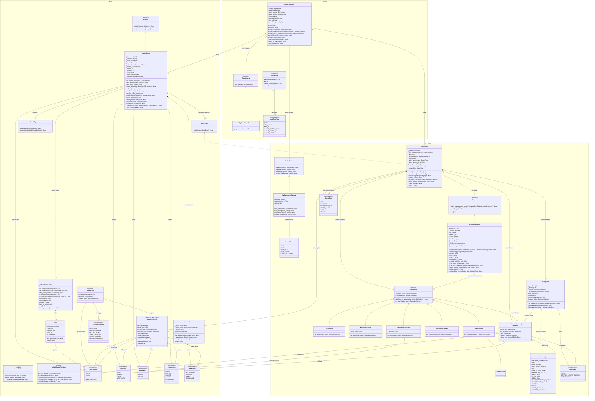

```mermaid
classDiagram
direction TB

namespace Model {
    class BoardsModule {
        <<module>>
        +giveBoard(difficulty: str) BoardData
        +display_brd(brd: BoardData) None
        -_is_consistent(board: BoardData) bool
    }


    class SudokuSolver {
        -_status: SolverStatus
        -_search_state: Optional~Iterator~bool~~
        -_animate: bool
        +status: SolverStatus
        +start(board: Board, animate: bool) None
        -_search(board: Board) Iterator~bool~
        +solve_step(board: Board) bool
        +reset() None
    }

    class SolverModuleFunctions {
        <<module>>
        +display_brd(brd: list~list~int~~) None
        +isFull(board: list~list~int~~) bool
        +findEmpty(board: list~list~int~~) Optional~tuple~int, int~~
        +possible(board: list~list~int~~, x: int, y: int, num: int) bool
        +autosolve(board: list~list~int~~) bool
    }


    class ISubject {
        <<interface>>
        +attach(observer: IObserver) None
        +detach(observer: IObserver) None
        +notify(event: ModelEvent) None
    }

    class IObserver {
        <<interface>>
        +update(event: ModelEvent) None
    }

    class SudokuGame {
        -_observers: list~IObserver~
        -_difficulty: Difficulty
        -_mode: GameMode
        -_status: GameStatus
        -_selected_cell: Optional~CellPosition~
        -_elapsed_seconds: float
        -_version: int
        -_message: str
        -_board: Board
        -_solver: SudokuSolver
        -_repository: BoardRepository
        +get_current_snapshot() GameSnapshot
        +start_game(difficulty: Difficulty) None
        +start_solver_mode() None
        +select_cell(position: Optional~CellPosition~) None
        +set_cell_value(value: int) bool
        +clear_selected_cell() bool
        +start_solving(animate: bool) None
        +advance_solver_step() bool
        +update_elapsed_time(delta_seconds: float) None
        +check_completion() bool
        +attach(observer: IObserver) None
        +detach(observer: IObserver) None
        +notify(event: ModelEvent) None
        -_publish(event_type: ModelEventType, changed: tuple) None
        -_sync_solver_status() None
    }

    class Board {
        -_cells: list~list~Cell~~
        +get_cell(position: CellPosition) Cell
        +set_value(position: CellPosition, value: int) bool
        +clear_value(position: CellPosition) bool
        +is_fixed(position: CellPosition) bool
        +is_valid_move(position: CellPosition, value: int) bool
        +is_complete() bool
        +is_consistent() bool
        +to_tuple() tuple
        +fixed_to_tuple() tuple
        +copy() Board
        +invalid_positions() tuple~CellPosition~
    }

    class Cell {
        +position: CellPosition
        -_value: int
        -_is_fixed: bool
        +value: int
        +is_fixed: bool
        +set_value(value: int) None
        +clear() None
    }

    class CellPosition {
        <<value object>>
        +row: int
        +col: int
        +__post_init__() None
    }

    class BoardRepository {
        +get_board(difficulty: Difficulty) Board
        +get_random_board(difficulty: Difficulty) Board
    }

    class GameSnapshot {
        <<immutable data object>>
        +version: int
        +board_data: tuple
        +fixed_cells: tuple
        +invalid_cells: tuple~CellPosition~
        +selected_cell: Optional~CellPosition~
        +difficulty: Difficulty
        +mode: GameMode
        +status: GameStatus
        +solver_status: SolverStatus
        +elapsed_seconds: float
        +message: str
    }

    class ModelEvent {
        <<dataclass>>
        +event_type: ModelEventType
        +snapshot: GameSnapshot
        +changed_cells: tuple~CellPosition~
    }

    class Difficulty {
        <<enumeration>>
        EASY
        MEDIUM
        HARD
        VERY_HARD
    }

    class GameMode {
        <<enumeration>>
        PUZZLE
        SOLVER
    }

    class GameStatus {
        <<enumeration>>
        READY
        PLAYING
        SOLVING
        SOLVED
        UNSOLVABLE
    }

    class SolverStatus {
        <<enumeration>>
        NOT_STARTED
        RUNNING
        SOLVED
        UNSOLVABLE
    }

    class ModelEventType {
        <<enumeration>>
        INITIAL_STATE
        BOARD_CHANGED
        CELL_SELECTED
        TIMER_CHANGED
        STATUS_CHANGED
        MESSAGE_CHANGED
    }
}


namespace Controller {
    class IEventSource {
        <<interface>>
        +poll_events() list~InputEvent~
    }

    class PyGameEventSource {
        +poll_events() list~InputEvent~
    }

    class GameController {
        -_model: SudokuGame
        -_view: SudokuView
        -_event_source: IEventSource
        -_audio_service: IAudioService
        -_running: bool
        -_animated_solving: bool
        -_last_tick: float
        -_completion_sound_played: bool
        +run() None
        +update() None
        +handle_event(event: InputEvent) None
        +handle_keyboard_input(event: InputEvent) Optional~UIAction~
        +handle_mouse_input(event: InputEvent) Optional~UIAction~
        +dispatch_action(action: UIAction) None
        +handle_solver_step() None
        -_play_completion_sound() None
        +return_to_main_menu() None
        +exit_application() None
    }

    class InputEvent {
        <<dataclass>>
        +event_type: InputEventType
        +key: str
        +mouse_position: tuple~int, int~
        +mouse_button: int
    }

    class InputEventType {
        <<enumeration>>
        QUIT
        KEY_DOWN
        KEY_UP
        MOUSE_BUTTON_DOWN
        MOUSE_BUTTON_UP
        MOUSE_MOTION
    }
}


namespace View {
    class IAudioService {
        <<interface>>
        +play_effect(effect: SoundEffect) None
        +play_background_music() None
        +pause_background_music() None
        +resume_background_music() None
    }

    class PyGameAudioService {
        -_pygame: pygame
        -_asset_directory: Path
        -_effects: dict
        -_enabled: bool
        +play_effect(effect: SoundEffect) None
        +play_background_music() None
        +pause_background_music() None
        +resume_background_music() None
    }

    class SoundEffect {
        <<enumeration>>
        CLICK
        MOVE
        GAME_START
        GAME_OVER
        CONGRATULATIONS
    }


    class IRenderer {
        <<interface>>
        +render_screen(screen: ScreenView, snapshot: Optional~GameSnapshot~) None
        +render_dialog(dialog: DialogView) None
        +present() None
        +close() None
    }

    class SudokuView {
        -_renderer: IRenderer
        -_last_snapshot: Optional~GameSnapshot~
        -_dirty: bool
        -_hovered_action: Optional~UIAction~
        -_screens: dict
        -_active_screen_type: ScreenType
        -_active_screen: ScreenView
        -_active_dialog: DialogView
        +active_screen_type: ScreenType
        +active_dialog: DialogView
        +update(event: ModelEvent) None
        +show_screen(screen: ScreenType) None
        +show_dialog(dialog: DialogType) None
        +dismiss_dialog() None
        +get_action_at(position: tuple) Optional~UIAction~
        +handle_pointer_move(position: tuple) None
        +render_if_dirty() None
        +close() None
    }

    class ScreenView {
        <<abstract>>
        -_hovered_action: Optional~UIAction~
        +hovered_action: Optional~UIAction~
        +set_hovered_action(action: Optional~UIAction~) None
        +hit_test(position: tuple) Optional~UIAction~
    }

    class IntroScreen {
        +hit_test(position: tuple) Optional~UIAction~
    }

    class MainMenuScreen {
        -_menu_items: tuple
        +hit_test(position: tuple) Optional~UIAction~
    }

    class DifficultyMenuScreen {
        -_difficulties: tuple
        +hit_test(position: tuple) Optional~UIAction~
    }

    class ScoreBoardScreen {
        +hit_test(position: tuple) Optional~UIAction~
    }

    class GameScreen {
        +hit_test(position: tuple) Optional~UIAction~
    }

    class SolverScreen {
    }

    class DialogView {
        -_type: DialogType
        -_message: str
        -_actions: tuple~UIActionType~
        -_hovered_action: Optional~UIAction~
        +type: DialogType
        +message: str
        +actions: tuple~UIActionType~
        +hovered_action: Optional~UIAction~
        +set_hovered_action(action: Optional~UIAction~) None
        +configure(dialog_type: DialogType) None
        +hit_test(position: tuple) Optional~UIAction~
    }

    class UIAction {
        <<frozen dataclass / data object>>
        +action_type: UIActionType
        +cell_position: Optional~CellPosition~
        +digit: Optional~int~
        +difficulty: Optional~Difficulty~
        +dialog_type: Optional~DialogType~
    }

    class UIActionType {
        <<enumeration>>
        CONTINUE_FROM_INTRO
        PLAY
        OPEN_SOLVER
        OPEN_SCORE_BOARD
        EXIT
        BACK_TO_MAIN_MENU
        CHOOSE_DIFFICULTY
        SELECT_CELL
        ENTER_DIGIT
        CLEAR_CELL
        REQUEST_RETURN_TO_MENU
        REQUEST_AUTO_SOLVE
        CONFIRM
        CANCEL
        DIRECT_SOLUTION
        ANIMATED_SOLUTION
    }

    class ScreenType {
        <<enumeration>>
        INTRO
        MAIN_MENU
        DIFFICULTY_MENU
        SCORE_BOARD
        GAME
        SOLVER
    }

    class DialogType {
        <<enumeration>>
        NONE
        CONFIRM_RETURN_TO_MENU
        AUTO_SOLVE
    }

    class PyGameRenderer {
        +WIDTH: int = 600
        +HEIGHT: int = 800
        -_pg: pygame
        -_assets: Path
        -_screen: Surface
        -_font_path: Path
        -_number_path: Path
        -_logo_path: Path
        -_active_screen: ScreenView
        -_last_screen_family: Optional~str~
        +render_screen(screen: ScreenView, snapshot: Optional~GameSnapshot~) None
        +render_dialog(dialog: DialogView) None
        +present() None
        +close() None
        -_text(...) None
        -_menu_back(...) None
        -_animate_grid(intro: bool) None
        -_draw_menu_background() None
        -_draw_board(snapshot: Optional~GameSnapshot~) None
        -_current_screen_hover(position: CellPosition) bool
        -_dialog_action(...) None
        -_active_dialog_hovered(action_type: UIActionType) bool
    }
}


%% Реализация интерфейсов (пунктирная линия и пустой треугольник)
ISubject <|.. SudokuGame
IObserver <|.. SudokuView
IEventSource <|.. PyGameEventSource
IRenderer <|.. PyGameRenderer
IAudioService <|.. PyGameAudioService

%% Модель: ассоциации и отношения владения
SudokuGame "1" o-- "0..*" IObserver : registered observers
SudokuGame "1" *-- "1" Board : current board
SudokuGame "1" *-- "1" SudokuSolver : solver instance
SudokuGame "1" -- "1" BoardRepository : repository
SudokuGame "1" -- "1" Difficulty : difficulty
SudokuGame "1" -- "1" GameMode : mode
SudokuGame "1" -- "1" GameStatus : status
SudokuGame "1" -- "0..1" CellPosition : selected cell

Board "1" *-- "81" Cell : cells
Cell "1" -- "1" CellPosition : position
SudokuSolver "1" -- "1" SolverStatus : status

ModelEvent "0..*" -- "1" GameSnapshot : snapshot
ModelEvent "0..*" -- "1" ModelEventType : event type
ModelEvent "0..*" -- "0..*" CellPosition : changed cells
GameSnapshot "0..*" -- "0..1" CellPosition : selected cell
GameSnapshot "0..*" -- "0..*" CellPosition : invalid cells
GameSnapshot "0..*" -- "1" Difficulty : difficulty
GameSnapshot "0..*" -- "1" GameMode : mode
GameSnapshot "0..*" -- "1" GameStatus : status
GameSnapshot "0..*" -- "1" SolverStatus : solver status

%% Контроллер: ссылки, хранящиеся в GameController
GameController "1" -- "1" SudokuGame : model
GameController "1" -- "1" SudokuView : view
GameController "1" -- "1" IEventSource : event source
GameController "1" -- "1" IAudioService : audio service
InputEvent "0..*" -- "1" InputEventType : event type

%% Представление: хранимые объекты и связи между состояниями
SudokuView "1" -- "1" IRenderer : renderer
SudokuView "1" -- "0..1" GameSnapshot : last snapshot
SudokuView "1" -- "0..1" UIAction : hovered action
SudokuView "1" -- "1" ScreenType : active screen type
SudokuView "1" *-- "6" ScreenView : screen instances
SudokuView "1" *-- "1" DialogView : dialog instance

ScreenView "1" -- "0..1" UIAction : hovered action
DialogView "1" -- "1" DialogType : type
DialogView "1" -- "0..*" UIActionType : available actions
DialogView "1" -- "0..1" UIAction : hovered action
DifficultyMenuScreen "1" -- "0..*" Difficulty : difficulty choices

%% Наследование экранов
ScreenView <|-- IntroScreen
ScreenView <|-- MainMenuScreen
ScreenView <|-- DifficultyMenuScreen
ScreenView <|-- ScoreBoardScreen
ScreenView <|-- GameScreen
GameScreen <|-- SolverScreen

UIAction "0..*" -- "1" UIActionType : action type
UIAction "0..*" -- "0..1" CellPosition : cell position
UIAction "0..*" -- "0..1" Difficulty : difficulty
UIAction "0..*" -- "0..1" DialogType : dialog type

%% Рендерер и аудиоадаптер
PyGameRenderer "1" -- "0..1" ScreenView : current screen reference
PyGameAudioService "1" -- "0..*" SoundEffect : loaded effects
```
