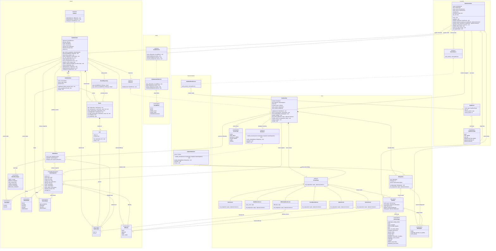

```mermaid
classDiagram
direction TB

namespace Model {
    class ISubject {
        <<interface>>
        +attach(observer: IObserver) void
        +detach(observer: IObserver) void
        +notify(event: ModelEvent) void
    }

    class IObserver {
        <<interface>>
        +update(event: ModelEvent) void
    }

    class SudokuGame {
        -observers: list~IObserver~
        -difficulty: Difficulty
        -mode: GameMode
        -status: GameStatus
        -selected_cell: CellPosition
        -elapsed_seconds: float
        -version: int
        +get_current_snapshot() GameSnapshot
        +start_game(difficulty: Difficulty) void
        +start_solver_mode() void
        +select_cell(position: CellPosition) void
        +set_cell_value(value: int) bool
        +clear_selected_cell() bool
        +start_solving(animate: bool) void
        +advance_solver_step() bool
        +update_elapsed_time(delta_seconds: float) void
        +check_completion() bool
        +attach(observer: IObserver) void
        +detach(observer: IObserver) void
        +notify(event: ModelEvent) void
    }

    class Board {
        +get_cell(position: CellPosition) Cell
        +set_value(position: CellPosition, value: int) bool
        +clear_value(position: CellPosition) bool
        +is_fixed(position: CellPosition) bool
        +is_valid_move(position: CellPosition, value: int) bool
        +is_complete() bool
        +is_consistent() bool
    }

    class Cell {
        -value: int
        -is_fixed: bool
        +set_value(value: int) void
        +clear() void
    }

    class CellPosition {
        <<value object>>
        +row: int
        +col: int
    }

    class SudokuSolver {
        -status: SolverStatus
        -search_state: object
        -animate: bool
        +start(board: Board, animate: bool) void
        +solve_step(board: Board) bool
        +reset() void
    }

    class BoardRepository {
        +get_board(difficulty: Difficulty) Board
        +get_random_board(difficulty: Difficulty) Board
    }

    class GameSnapshot {
        <<immutable data object>>
        +version: int
        +board_data: tuple
        +fixed_cells: tuple
        +invalid_cells: tuple
        +selected_cell: CellPosition
        +difficulty: Difficulty
        +mode: GameMode
        +status: GameStatus
        +solver_status: SolverStatus
        +elapsed_seconds: float
        +message: str
    }

    class ModelEvent {
        +event_type: ModelEventType
        +snapshot: GameSnapshot
        +changed_cells: tuple~CellPosition~
    }

    class Difficulty {
        <<enumeration>>
        EASY
        MEDIUM
        HARD
        VERY_HARD
    }

    class GameMode {
        <<enumeration>>
        PUZZLE
        SOLVER
    }

    class GameStatus {
        <<enumeration>>
        READY
        PLAYING
        SOLVING
        SOLVED
        UNSOLVABLE
    }

    class SolverStatus {
        <<enumeration>>
        NOT_STARTED
        RUNNING
        SOLVED
        UNSOLVABLE
    }

    class ModelEventType {
        <<enumeration>>
        INITIAL_STATE
        BOARD_CHANGED
        CELL_SELECTED
        TIMER_CHANGED
        STATUS_CHANGED
        MESSAGE_CHANGED
    }
}

namespace Controller {
    class IEventSource {
        <<interface>>
        +poll_events() list~InputEvent~
    }

    class GameController {
        -model: SudokuGame
        -view: SudokuView
        -event_source: IEventSource
        -audio_service: IAudioService
        -running: bool
        -animated_solving: bool
        -last_tick: float
        +run() void
        +update() void
        +handle_event(event: InputEvent) void
        +handle_keyboard_input(event: InputEvent) Optional~UIAction~
        +handle_mouse_input(event: InputEvent) Optional~UIAction~
        +dispatch_action(action: UIAction) void
        +handle_solver_step() void
        +return_to_main_menu() void
        +exit_application() void
    }

    class InputEvent {
        +event_type: InputEventType
        +key: str
        +mouse_position: tuple
        +mouse_button: int
    }

    class InputEventType {
        <<enumeration>>
        QUIT
        KEY_DOWN
        KEY_UP
        MOUSE_BUTTON_DOWN
        MOUSE_BUTTON_UP
        MOUSE_MOTION
    }
}

namespace View {
    class IRenderer {
        <<interface>>
        +render_screen(screen: ScreenView, snapshot: GameSnapshot) void
        +render_dialog(dialog: DialogView) void
        +present() void
        +close() void
    }

    class SudokuView {
        -renderer: IRenderer
        -last_snapshot: GameSnapshot
        -dirty: bool
        -hovered_action: UIAction
        -active_screen: ScreenView
        -active_dialog: DialogView
        +update(event: ModelEvent) void
        +show_screen(screen: ScreenType) void
        +show_dialog(dialog: DialogType) void
        +dismiss_dialog() void
        +get_action_at(position: tuple) Optional~UIAction~
        +handle_pointer_move(position: tuple) void
        -render_if_dirty() void
        +close() void
    }

    class ScreenView {
        <<abstract>>
        +hit_test(position: tuple) Optional~UIAction~
    }

    class IntroScreen {
        +hit_test(position: tuple) Optional~UIAction~
    }

    class MainMenuScreen {
        -menu_items: tuple
        +hit_test(position: tuple) Optional~UIAction~
    }

    class DifficultyMenuScreen {
        -difficulties: tuple
        +hit_test(position: tuple) Optional~UIAction~
    }

    class ScoreBoardScreen {
        +hit_test(position: tuple) Optional~UIAction~
    }

    class GameScreen {
        +hit_test(position: tuple) Optional~UIAction~
    }

    class SolverScreen {
        +hit_test(position: tuple) Optional~UIAction~
    }

    class DialogView {
        -type: DialogType
        -message: str
        -actions: tuple~UIActionType~
        +configure(type: DialogType) void
        +hit_test(position: tuple) Optional~UIAction~
    }

    class UIAction {
        <<data object>>
        +action_type: UIActionType
        +cell_position: Optional~CellPosition~
        +digit: Optional~int~
        +difficulty: Optional~Difficulty~
        +dialog_type: Optional~DialogType~
    }

    class UIActionType {
        <<enumeration>>
        CONTINUE_FROM_INTRO
        PLAY
        OPEN_SOLVER
        OPEN_SCORE_BOARD
        EXIT
        BACK_TO_MAIN_MENU
        CHOOSE_DIFFICULTY
        SELECT_CELL
        ENTER_DIGIT
        CLEAR_CELL
        REQUEST_RETURN_TO_MENU
        REQUEST_AUTO_SOLVE
        CONFIRM
        CANCEL
        DIRECT_SOLUTION
        ANIMATED_SOLUTION
    }

    class ScreenType {
        <<enumeration>>
        INTRO
        MAIN_MENU
        DIFFICULTY_MENU
        SCORE_BOARD
        GAME
        SOLVER
    }

    class DialogType {
        <<enumeration>>
        NONE
        CONFIRM_RETURN_TO_MENU
        AUTO_SOLVE
    }
}

namespace Audio {
    class IAudioService {
        <<interface>>
        +play_effect(effect: SoundEffect) void
        +play_background_music() void
        +pause_background_music() void
        +resume_background_music() void
    }

    class PyGameAudioService {
        +play_effect(effect: SoundEffect) void
        +play_background_music() void
        +pause_background_music() void
        +resume_background_music() void
    }

    class SoundEffect {
        <<enumeration>>
        CLICK
        MOVE
        GAME_START
        GAME_OVER
        CONGRATULATIONS
    }
}

namespace PyGameAdapter {
    class PyGameEventSource {
        +poll_events() list~InputEvent~
    }

    class PyGameRenderer {
        -screen: Surface
        +render_screen(screen: ScreenView, snapshot: GameSnapshot) void
        +render_dialog(dialog: DialogView) void
        +present() void
        +close() void
    }
}

ISubject <|.. SudokuGame
IObserver <|.. SudokuView
IEventSource <|.. PyGameEventSource
IRenderer <|.. PyGameRenderer
IAudioService <|.. PyGameAudioService

SudokuGame "1" o-- "0..*" IObserver : observers
SudokuGame "1" *-- "1" Board : current board
SudokuGame "1" *-- "0..1" SudokuSolver : solver
SudokuGame "1" -- "1" BoardRepository : loads puzzles
SudokuGame "1" -- "0..*" GameSnapshot : creates snapshots
SudokuGame "1" -- "0..*" ModelEvent : publishes events
SudokuGame "1" -- "1" Difficulty : selected difficulty
SudokuGame "1" -- "1" GameMode : current mode
SudokuGame "1" -- "1" GameStatus : current status
SudokuGame "1" -- "0..1" CellPosition : selected cell

Board "1" *-- "81" Cell : consists of
Cell "1" -- "1" CellPosition : position
SudokuSolver "1" -- "1" Board : solves
SudokuSolver "1" -- "1" SolverStatus : status
BoardRepository "1" -- "0..*" Board : provides puzzles

ModelEvent "0..*" -- "1" GameSnapshot : contains snapshot
ModelEvent "0..*" -- "1" ModelEventType : event type
ModelEvent "0..*" -- "0..*" CellPosition : changed cells
GameSnapshot "0..*" -- "0..1" CellPosition : selected cell
GameSnapshot "0..*" -- "1" Difficulty : difficulty
GameSnapshot "0..*" -- "1" GameMode : mode
GameSnapshot "0..*" -- "1" GameStatus : status
GameSnapshot "0..*" -- "1" SolverStatus : solver status

GameController "1" -- "1" SudokuGame : sends commands
GameController "1" -- "1" SudokuView : controls navigation
GameController "1" -- "1" IEventSource : receives input
GameController "1" -- "1" IAudioService : controls audio
GameController "1" -- "0..1" DialogType : selects dialog
GameController "1" -- "0..*" InputEvent : processes
GameController "1" -- "0..*" UIAction : dispatches

InputEvent "0..*" -- "1" InputEventType : event type
PyGameEventSource "1" -- "0..*" InputEvent : creates events

SudokuView "1" -- "1" IRenderer : delegates rendering
SudokuView "1" -- "0..*" ModelEvent : receives notifications
SudokuView "1" -- "0..1" GameSnapshot : latest snapshot
SudokuView "1" *-- "1..*" ScreenView : owns screens
SudokuView "1" *-- "1" DialogView : reusable dialog
SudokuView "1" -- "1" ScreenType : active screen
DialogView "1" -- "1" DialogType : current configuration

ScreenView <|-- IntroScreen
ScreenView <|-- MainMenuScreen
ScreenView <|-- DifficultyMenuScreen
ScreenView <|-- ScoreBoardScreen
ScreenView <|-- GameScreen
ScreenView <|-- SolverScreen

ScreenView "1" -- "0..*" UIAction : hit test results
DialogView "1" -- "0..*" UIAction : hit test results
DifficultyMenuScreen "1" -- "0..*" Difficulty : difficulty choices

UIAction "0..*" -- "1" UIActionType : action type
UIAction "0..*" -- "0..1" CellPosition : selected cell
UIAction "0..*" -- "0..1" Difficulty : selected difficulty
UIAction "0..*" -- "0..1" DialogType : dialog context

PyGameRenderer "1" -- "0..*" GameSnapshot : displays state
PyGameRenderer "1" -- "0..*" ScreenView : draws screens
PyGameRenderer "1" -- "0..1" DialogView : draws active dialog
PyGameAudioService "1" -- "0..*" SoundEffect : plays effects
```
