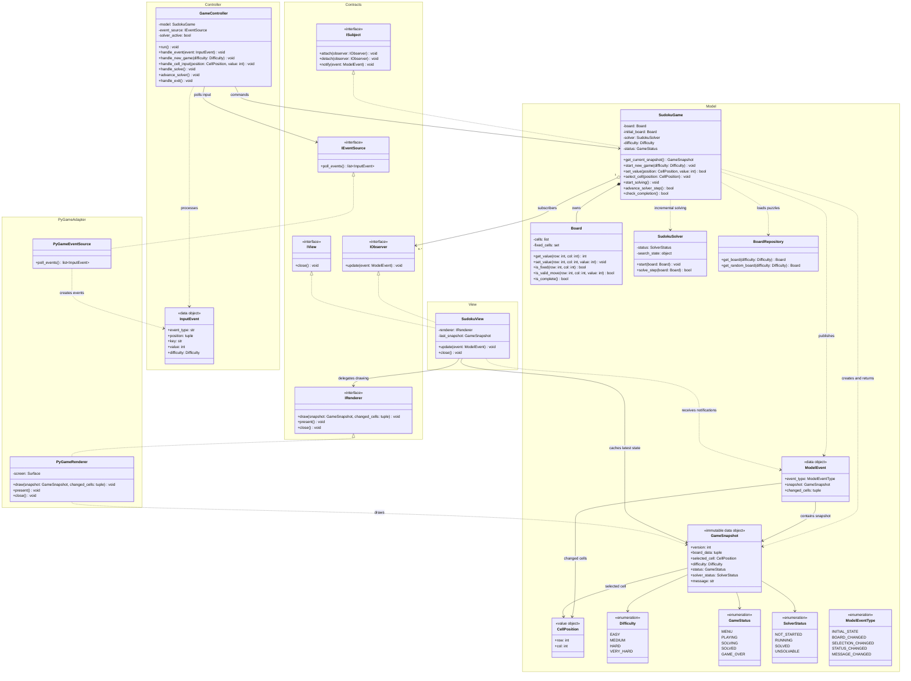

```mermaid
classDiagram
direction TB

namespace Contracts {
    class IView {
        <<interface>>
        +close() void
    }

    class IEventSource {
        <<interface>>
        +poll_events() list~InputEvent~
    }

    class IObserver {
        <<interface>>
        +update(event: ModelEvent) void
    }

    class ISubject {
        <<interface>>
        +attach(observer: IObserver) void
        +detach(observer: IObserver) void
        +notify(event: ModelEvent) void
    }

    class IRenderer {
        <<interface>>
        +draw(snapshot: GameSnapshot, changed_cells: tuple) void
        +present() void
        +close() void
    }
}

namespace Model {
    class SudokuGame {
        -board: Board
        -initial_board: Board
        -solver: SudokuSolver
        -difficulty: Difficulty
        -status: GameStatus
        +get_current_snapshot() GameSnapshot
        +start_new_game(difficulty: Difficulty) void
        +set_value(position: CellPosition, value: int) bool
        +select_cell(position: CellPosition) void
        +start_solving() void
        +advance_solver_step() bool
        +check_completion() bool
    }

    class Board {
        -cells: list
        -fixed_cells: set
        +get_value(row: int, col: int) int
        +set_value(row: int, col: int, value: int) void
        +is_fixed(row: int, col: int) bool
        +is_valid_move(row: int, col: int, value: int) bool
        +is_complete() bool
    }

    class SudokuSolver {
        -status: SolverStatus
        -search_state: object
        +start(board: Board) void
        +solve_step(board: Board) bool
    }

    class BoardRepository {
        +get_board(difficulty: Difficulty) Board
        +get_random_board(difficulty: Difficulty) Board
    }

    class GameSnapshot {
        <<immutable data object>>
        +version: int
        +board_data: tuple
        +selected_cell: CellPosition
        +difficulty: Difficulty
        +status: GameStatus
        +solver_status: SolverStatus
        +message: str
    }

    class ModelEvent {
        <<data object>>
        +event_type: ModelEventType
        +snapshot: GameSnapshot
        +changed_cells: tuple
    }

    class CellPosition {
        <<value object>>
        +row: int
        +col: int
    }

    class Difficulty {
        <<enumeration>>
        EASY
        MEDIUM
        HARD
        VERY_HARD
    }

    class GameStatus {
        <<enumeration>>
        MENU
        PLAYING
        SOLVING
        SOLVED
        GAME_OVER
    }

    class SolverStatus {
        <<enumeration>>
        NOT_STARTED
        RUNNING
        SOLVED
        UNSOLVABLE
    }

    class ModelEventType {
        <<enumeration>>
        INITIAL_STATE
        BOARD_CHANGED
        SELECTION_CHANGED
        STATUS_CHANGED
        MESSAGE_CHANGED
    }
}

namespace Controller {
    class GameController {
        -model: SudokuGame
        -event_source: IEventSource
        -solver_active: bool
        +run() void
        +handle_event(event: InputEvent) void
        +handle_new_game(difficulty: Difficulty) void
        +handle_cell_input(position: CellPosition, value: int) void
        +handle_solve() void
        +advance_solver() void
        +handle_exit() void
    }

    class InputEvent {
        <<data object>>
        +event_type: str
        +position: tuple
        +key: str
        +value: int
        +difficulty: Difficulty
    }
}

namespace View {
    class SudokuView {
        -renderer: IRenderer
        -last_snapshot: GameSnapshot
        +update(event: ModelEvent) void
        +close() void
    }
}

namespace PyGameAdapter {
    class PyGameRenderer {
        -screen: Surface
        +draw(snapshot: GameSnapshot, changed_cells: tuple) void
        +present() void
        +close() void
    }

    class PyGameEventSource {
        +poll_events() list~InputEvent~
    }
}

ISubject <|.. SudokuGame
IObserver <|.. SudokuView
IView <|.. SudokuView
IRenderer <|.. PyGameRenderer
IEventSource <|.. PyGameEventSource

SudokuGame "1" o--> "0..*" IObserver : subscribers
SudokuGame *-- Board : owns
SudokuGame ..> SudokuSolver : incremental solving
SudokuGame ..> BoardRepository : loads puzzles
SudokuGame ..> GameSnapshot : creates and returns
SudokuGame ..> ModelEvent : publishes

ModelEvent --> GameSnapshot : contains snapshot
ModelEvent --> CellPosition : changed cells
GameSnapshot --> CellPosition : selected cell
GameSnapshot --> Difficulty
GameSnapshot --> GameStatus
GameSnapshot --> SolverStatus

SudokuView ..> ModelEvent : receives notifications
SudokuView --> IRenderer : delegates drawing
SudokuView --> GameSnapshot : caches latest state
PyGameRenderer ..> GameSnapshot : draws

GameController --> SudokuGame : commands
GameController --> IEventSource : polls input
GameController ..> InputEvent : processes
PyGameEventSource ..> InputEvent : creates events
```
